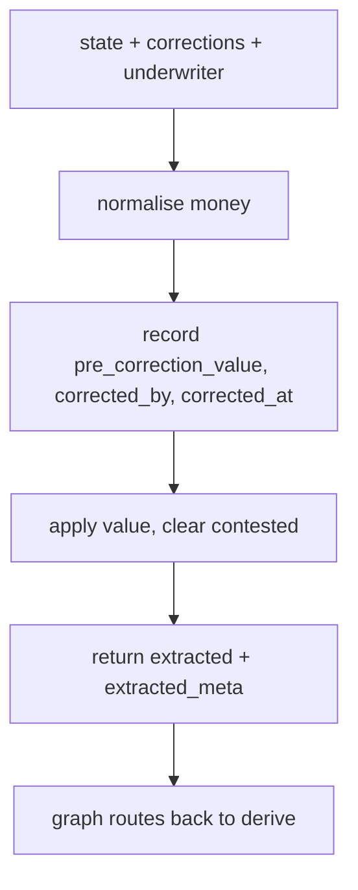

# correct.py — correction + re-evaluation trail

```mermaid
flowchart TD
    A[state + corrections + underwriter] --> B[normalise money]
    B --> C[record pre_correction_value, corrected_by, corrected_at]
    C --> D[apply value, clear contested]
    D --> E[return extracted + extracted_meta]
    E --> F[graph routes back to derive]
```

**Business context:** nothing overwritten silently — full audit trail (BFR-EXT-006/007). Corrections flow into the audit record and evidence pack.
