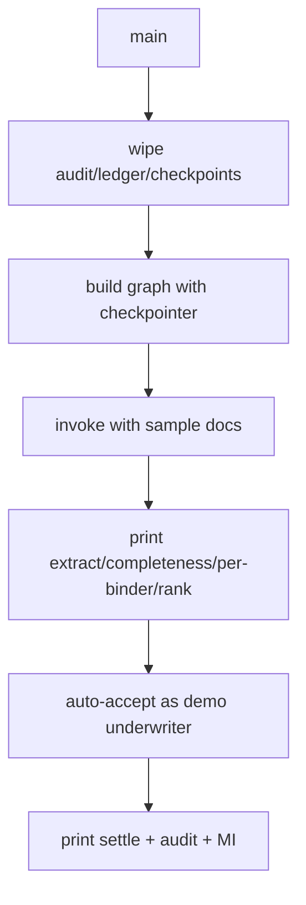

# demo.py — self-resetting end-to-end demo

```mermaid
flowchart TD
    A[main] --> B[wipe audit/ledger/checkpoints]
    B --> C[build graph with checkpointer]
    C --> D[invoke with sample docs]
    D --> E[print extract/completeness/per-binder/rank]
    E --> F[auto-accept as demo underwriter]
    F --> G[print settle + audit + MI]
```

**Business context:** deterministic stub extractor, no API key; demonstrates full gate chain and MI in one command.
