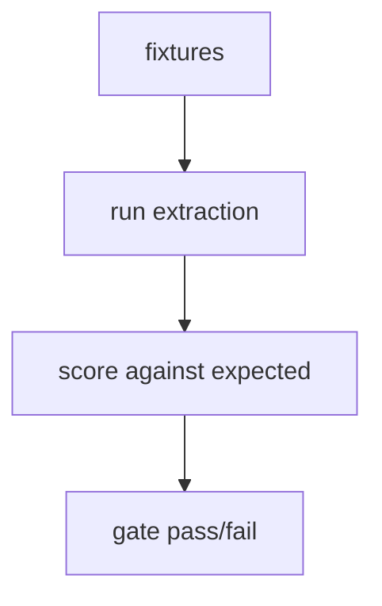

# scripts/eval_extraction.py — nightly extraction eval

```mermaid
flowchart TD
    A[fixtures] --> B[run extraction]
    B --> C[score against expected]
    C --> D[gate pass/fail]
```

**Business context:** nightly Nemotron extraction eval gate consuming repo secret.
