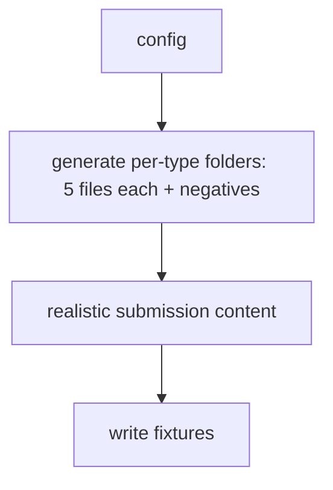

# scripts/gen_parse_fixtures.py — fixture generator

```mermaid
flowchart TD
    A[config] --> B[generate per-type folders: 5 files each + negatives]
    B --> C[realistic submission content]
    C --> D[write fixtures]
```

**Business context:** builds the 25-file parsing dataset (5 per type) with negatives.
