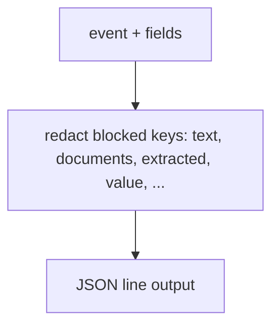

# log.py — content-redacting logs

```mermaid
flowchart TD
    A[event + fields] --> B[redact blocked keys: text, documents, extracted, value, ...]
    B --> C[JSON line output]
```

**Business context:** NFR-003/024 — structured logs never carry submission content.
