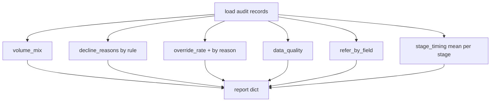

# mi.py — MI reports

```mermaid
flowchart TD
    A[load audit records] --> B[volume_mix]
    A --> C[decline_reasons by rule]
    A --> D[override_rate + by reason]
    A --> E[data_quality]
    A --> F[refer_by_field]
    A --> G[stage_timing mean per stage]
    B --> H[report dict]
    C --> H
    D --> H
    E --> H
    F --> H
    G --> H
```

**Business context:** MI-001..006 — volume, decline rank, override rate, quality, refer-by-field, stage timings.
