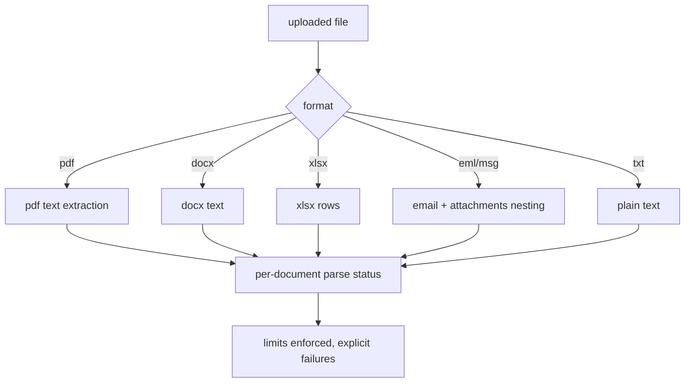

# parse.py — document parsing (5 formats)

```mermaid
flowchart TD
    A[uploaded file] --> B{format}
    B -->|pdf| C[pdf text extraction]
    B -->|docx| D[docx text]
    B -->|xlsx| E[xlsx rows]
    B -->|eml/msg| F[email + attachments nesting]
    B -->|txt| G[plain text]
    C --> H[per-document parse status]
    D --> H
    E --> H
    F --> H
    G --> H
    H --> I[limits enforced, explicit failures]
```

**Business context:** real document intake (BFR-EXT); nesting for emails; explicit failures rather than silent skips; limits enforced.
