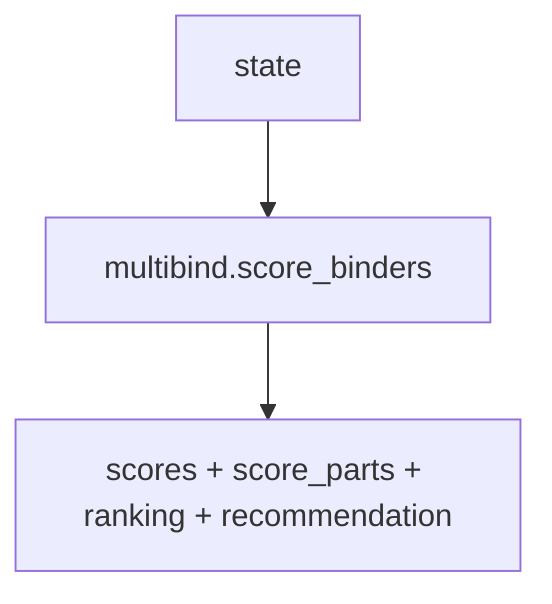

# rank.py — scoring wrapper

```mermaid
flowchart TD
    A[state] --> B[multibind.score_binders]
    B --> C[scores + score_parts + ranking + recommendation]
```

**Business context:** thin wrapper so the graph node name stays `rank`; all logic lives in multibind (BFR-REC-003/005/006).
