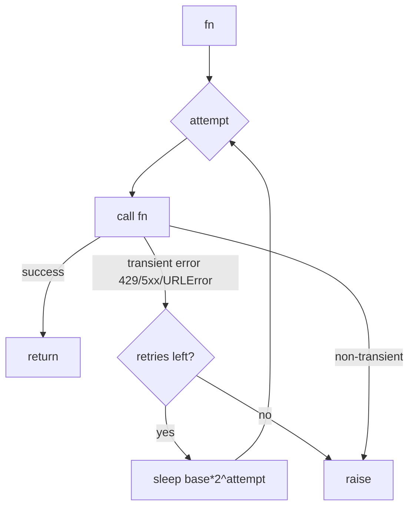

# retry.py — bounded backoff

```mermaid
flowchart TD
    A[fn] --> B{attempt}
    B --> C[call fn]
    C -->|success| D[return]
    C -->|transient error 429/5xx/URLError| E{retries left?}
    E -->|yes| F[sleep base*2^attempt]
    F --> B
    E -->|no| G[raise]
    C -->|non-transient| G
```

**Business context:** NFR-016 — transient failures retried with backoff; non-transient fail fast; blast radius bounded.
