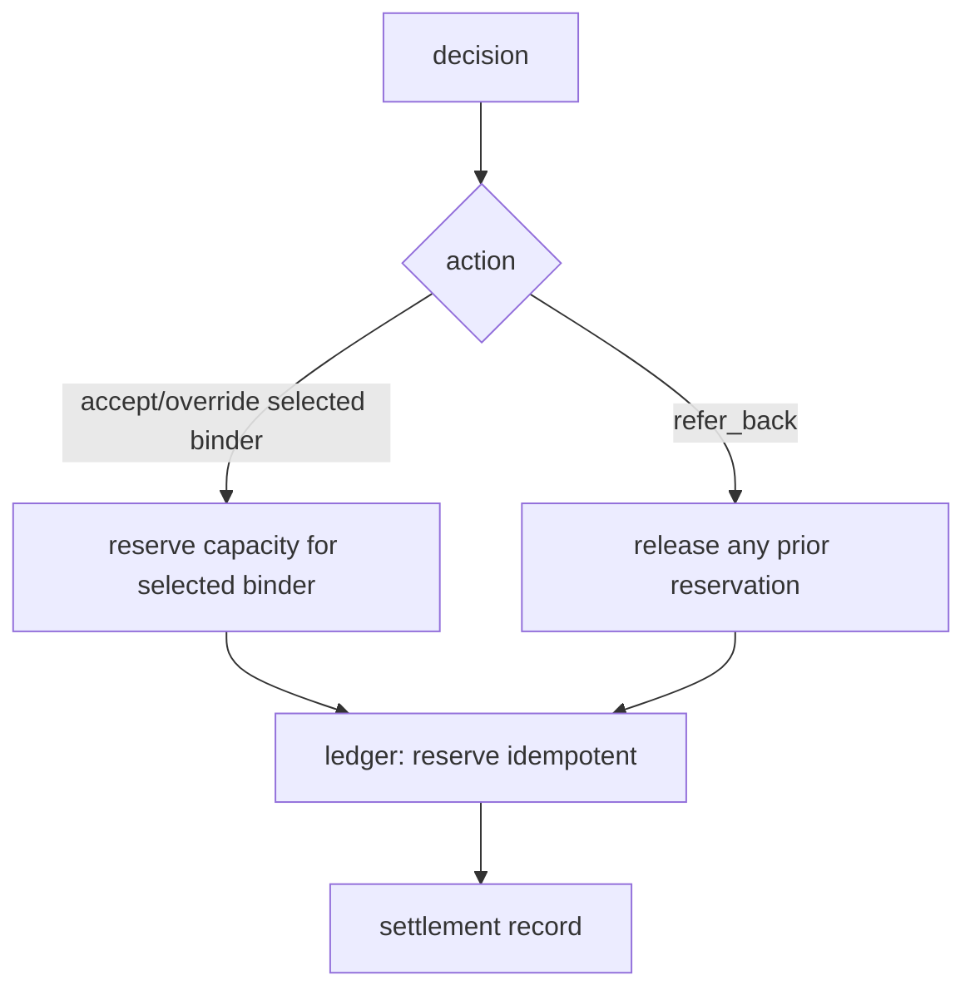

# settle.py — capacity reservation / release

```mermaid
flowchart TD
    A[decision] --> B{action}
    B -->|accept/override selected binder| C[reserve capacity for selected binder]
    B -->|refer_back| D[release any prior reservation]
    C --> E[ledger: reserve idempotent]
    D --> E
    E --> F[settlement record]
```

**Business context:** BFR-CAP-008/009 — bind only on underwriter decision; idempotent reservation prevents double-counting.
