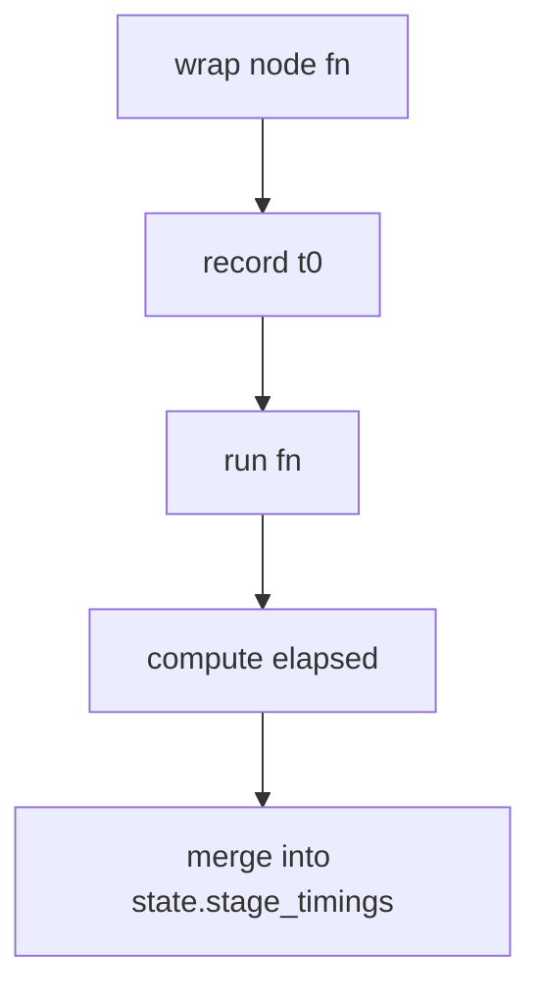

# timing.py — stage durations (MI-006)

```mermaid
flowchart TD
    A[wrap node fn] --> B[record t0]
    B --> C[run fn]
    C --> D[compute elapsed]
    D --> E[merge into state.stage_timings]
```

**Business context:** MI-006 — per-stage wall time for MI reporting; human-wait in review included and labelled.
