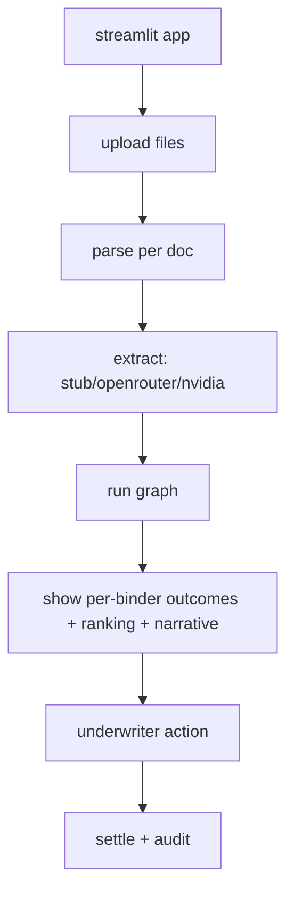

# ui/app.py — local UI

```mermaid
flowchart TD
    A[streamlit app] --> B[upload files]
    B --> C[parse per doc]
    C --> D[extract: stub/openrouter/nvidia]
    D --> E[run graph]
    E --> F[show per-binder outcomes + ranking + narrative]
    F --> G[underwriter action]
    G --> H[settle + audit]
```

**Business context:** local UI over the same graph; supports BYOK OpenRouter/NVIDIA; shows parse status table.
