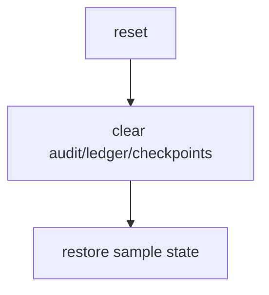

# ui/reset_demo.py — demo reset

```mermaid
flowchart TD
    A[reset] --> B[clear audit/ledger/checkpoints]
    B --> C[restore sample state]
```

**Business context:** resets demo to clean state for repeatable demos.
